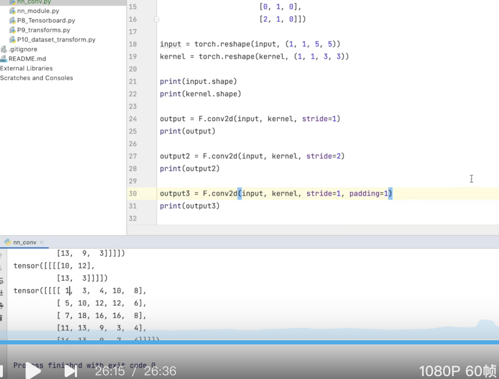

有显卡对深度学习很有用


### basic linux commands


#### dir(python) 打开看见所有的directory 工具箱

#### help(python) 说明书


#### data  dataset and dataloader


terminal 打开python
```py
>>> import torch
>>> torch.cuda.is_available()
False# 如果是true 说明可以使用gpu

```


看起来你是想了解 **TensorBoard**，这是一个用于可视化和监控机器学习模型训练过程的工具，尤其是在 TensorFlow 和 PyTorch 中使用。

### 什么是 TensorBoard？
TensorBoard 是一个交互式工具，允许你可视化模型训练过程中的各种指标和数据，比如：
- 随时间变化的损失值和准确度
- 计算图（computational graph）
- 权重和偏置的直方图分布
- 训练中的图像、音频和文本数据
- 嵌入（例如，词向量嵌入）

TensorBoard 常用于调试模型、追踪训练进度以及对比不同的训练结果。

### 在 PyTorch 中使用 TensorBoard
尽管 TensorBoard 最初是为 TensorFlow 设计的，但你也可以在 PyTorch 中使用它，通过 `torch.utils.tensorboard` 模块来记录和可视化训练过程中的数据。


`NumPy` 是一个用于科学计算的 Python 库，广泛应用于数据分析、机器学习、深度学习等领域。它的主要优势和好处包括以下几点：

### 1. **高效的数组操作**
   - **多维数组（ndarray）**：`NumPy` 提供了强大的多维数组对象（`ndarray`），它比 Python 内置的列表（list）要高效得多。`ndarray` 数组的元素是固定类型的，这使得它能够在内存中存储数据时更加紧凑，处理速度更快。
   - **向量化操作**：`NumPy` 支持向量化运算，即可以对整个数组进行批量操作，而不需要使用 Python 的 `for` 循环。这使得运算效率大幅提高。

   ```python
   import numpy as np
   # 普通 Python 列表计算
   a = [1, 2, 3, 4]
   b = [5, 6, 7, 8]
   result = [x + y for x, y in zip(a, b)]  # 使用 for 循环计算

   # NumPy 数组计算
   arr_a = np.array([1, 2, 3, 4])
   arr_b = np.array([5, 6, 7, 8])
   result = arr_a + arr_b  # 向量化操作
   ```

   向量化操作显著提高了运算效率，避免了循环和逐个元素处理的低效做法。

### 2. **内存效率高**
   - `NumPy` 使用固定大小的数据类型（如 `int32`, `float64` 等），这样可以避免 Python 列表中动态类型带来的内存开销。`NumPy` 的数组是连续存储在内存中的，能够快速访问和操作大量数据。
   - 由于 `NumPy` 数组是同质的（所有元素的数据类型相同），因此可以利用底层 C 语言的优化进行内存管理，使得数组操作更加高效。

### 3. **高效的数学运算**
   - `NumPy` 提供了许多数学函数，包括线性代数、统计分析、傅里叶变换等，可以非常高效地处理这些操作。例如，矩阵乘法、特征值分解、矩阵逆等常见的数学运算在 `NumPy` 中可以直接调用，避免了手动实现的复杂性。
   
   ```python
   A = np.array([[1, 2], [3, 4]])
   B = np.array([[5, 6], [7, 8]])
   result = np.dot(A, B)  # 矩阵乘法
   ```

### 4. **强大的广播功能（Broadcasting）**
   - **广播（Broadcasting）** 是 `NumPy` 的一个非常强大的特性，它可以让不同形状的数组进行算术运算时自动扩展（广播）它们的形状，从而避免了显式地复制数据。例如，可以将一个标量与数组进行运算，`NumPy` 会自动处理数组形状的对齐。
   
   ```python
   arr = np.array([1, 2, 3])
   result = arr + 10  # 数组和标量的广播
   ```

   通过广播，`NumPy` 实现了对大规模数据的高效操作，避免了不必要的内存复制。

### 5. **丰富的功能和工具**
   - `NumPy` 提供了许多用于数组操作、矩阵操作、线性代数、统计学、傅里叶变换、随机数生成等功能。
   - 例如，常用的 `np.mean()`, `np.median()`, `np.std()` 等统计函数，或者 `np.linalg.inv()` 计算矩阵的逆，都可以通过 `NumPy` 提供的函数高效完成。

### 6. **与其他库兼容性强**
   - `NumPy` 是许多其他科学计算库的基础，如 `SciPy`、`Pandas`、`scikit-learn`、`TensorFlow`、`PyTorch` 等。这些库通常都使用 `NumPy` 数组作为数据交换的标准格式，因此 `NumPy` 是数据科学和机器学习中的基础工具。
   - 使用 `NumPy` 数组作为数据输入，可以轻松地与这些工具结合，进行高效的处理和建模。

### 7. **支持多维数据（矩阵和张量）**
   - `NumPy` 支持 n 维数组（`ndarray`），这使得它非常适合处理高维数据，如图像、视频、时间序列数据等。可以轻松进行矩阵和张量操作，在机器学习和深度学习领域尤为重要。

### 8. **强大的索引和切片功能**
   - `NumPy` 提供了强大的索引和切片功能，允许用户方便地访问和修改数组中的元素。与传统的 Python 列表不同，`NumPy` 数组支持多维切片、条件索引、布尔索引等，使得数据提取更加灵活和高效。

   ```python
   arr = np.array([[1, 2, 3], [4, 5, 6], [7, 8, 9]])
   print(arr[1, 2])  # 访问特定元素
   print(arr[:, 1])  # 切片操作，获取第二列
   ```

### 9. **快速的数据处理**
   - `NumPy` 利用 C 语言实现，运算速度非常快，尤其适用于大规模的数据处理。与纯 Python 代码相比，`NumPy` 在数组运算中通常能够提供数倍的性能提升。

### 10. **支持随机数生成**
   - `NumPy` 提供了强大的随机数生成功能，可以用于模拟、统计分析、机器学习等应用。你可以生成均匀分布、正态分布等多种类型的随机数，且可以设置种子以确保结果可复现。

   ```python
   random_array = np.random.randn(3, 3)  # 生成一个 3x3 的正态分布随机数组
   ```

### 总结
`NumPy` 的好处主要体现在它的高效数组操作、广泛的数学函数支持、内存优化、与其他科学计算库的兼容性以及强大的广播功能等方面。它是数据分析、科学计算、机器学习和深度学习等领域中不可或缺的基础工具。

### pytorch 中的transform


在 PyTorch 中，`transform`（转换）是指在加载数据时对数据进行预处理或增强的一组操作。`transform` 常用于图像数据的预处理，它可以对图像进行缩放、裁剪、标准化等处理。`transform` 是 PyTorch 中 `torchvision.transforms` 模块的一个重要功能，用于构建一个转换管道，可以对图像数据进行一系列处理。

### 1. **`torchvision.transforms` 介绍**
PyTorch 提供了 `torchvision.transforms` 模块，包含了多种常用的图像转换操作。你可以将多个转换操作组合成一个转换管道，按顺序对图像数据进行处理。

### 2. **常见的 `transforms` 操作**
以下是一些常见的图像转换操作：

#### 2.1 **`ToTensor()`**
- 将 PIL 图像或 `numpy.ndarray` 转换为 PyTorch 的 `Tensor` 类型，并且将像素值从 `[0, 255]` 范围缩放到 `[0.0, 1.0]` 范围。
- 用于转换输入数据，使其适应 PyTorch 的神经网络。

```python
from torchvision import transforms

transform = transforms.ToTensor()
# 将图像转换为 Tensor 类型
tensor_image = transform(image)
```

#### 2.2 **`Normalize(mean, std)`**
- 对图像进行归一化处理，通常用于将图像的每个通道（R、G、B）的均值和标准差调整到指定值。
- 归一化后图像的每个通道的像素值将被调整为 `(x - mean) / std`，这通常可以帮助加速模型的训练。

```python
transform = transforms.Compose([
    transforms.ToTensor(),
    transforms.Normalize(mean=[0.485, 0.456, 0.406], std=[0.229, 0.224, 0.225])  # 常见的 ImageNet 均值和标准差
])
```

#### 2.3 **`Resize(size)`**
- 将图像调整到指定的尺寸（宽度，高度），`size` 可以是一个整数或一个二元组 `(width, height)`。
- 常用于将图像调整为神经网络模型所需的输入尺寸。

```python
transform = transforms.Resize((256, 256))  # 调整图像为 256x256 大小
```

#### 2.4 **`CenterCrop(size)`**
- 从图像中心裁剪出一个给定尺寸的区域，常用于图像的中心区域提取。

```python
transform = transforms.CenterCrop(224)  # 从图像中心裁剪出 224x224 大小的区域
```

#### 2.5 **`RandomCrop(size)`**
- 随机裁剪图像，裁剪出一个指定大小的区域。这是数据增强中常见的一种方法，用于增加训练数据的多样性。

```python
transform = transforms.RandomCrop(224)  # 随机裁剪出 224x224 的区域
```

#### 2.6 **`RandomHorizontalFlip(p)`**
- 随机水平翻转图像。常用于数据增强，通过水平翻转增加数据的多样性。

```python
transform = transforms.RandomHorizontalFlip(p=0.5)  # 以 50% 的概率进行水平翻转
```

#### 2.7 **`RandomRotation(degrees)`**
- 随机旋转图像指定的角度范围，通常用于数据增强。

```python
transform = transforms.RandomRotation(30)  # 随机旋转图像，角度在 -30 到 +30 度之间
```

#### 2.8 **`ColorJitter(brightness, contrast, saturation, hue)`**
- 随机调整图像的亮度、对比度、饱和度或色调，用于数据增强。

```python
transform = transforms.ColorJitter(brightness=0.2, contrast=0.2, saturation=0.2, hue=0.2)
```

#### 2.9 **`RandomAffine(degrees, translate, scale, shear)`**
- 随机仿射变换，包括旋转、平移、缩放和剪切。

```python
transform = transforms.RandomAffine(30, translate=(0.1, 0.1), scale=(0.8, 1.2), shear=10)
```

### 3. **`transforms.Compose()`**
- 你可以使用 `transforms.Compose()` 来组合多个变换操作，形成一个转换管道。
- 这样，你可以将一系列转换按顺序应用到图像上。

```python
transform = transforms.Compose([
    transforms.Resize(256),
    transforms.CenterCrop(224),
    transforms.ToTensor(),
    transforms.Normalize(mean=[0.485, 0.456, 0.406], std=[0.229, 0.224, 0.225])
])
```

### 4. **`transforms` 在数据集中的应用**
通常，`transform` 是与 PyTorch 的数据集（如 `torchvision.datasets`）结合使用的。通过在数据集加载时应用转换，你可以在加载图像时对其进行预处理。

```python
from torchvision import datasets, transforms

transform = transforms.Compose([
    transforms.Resize(256),
    transforms.CenterCrop(224),
    transforms.ToTensor(),
    transforms.Normalize(mean=[0.485, 0.456, 0.406], std=[0.229, 0.224, 0.225])
])

train_dataset = datasets.CIFAR10(root='./data', train=True, download=True, transform=transform)
```

### 5. **`transforms` 处理不同类型的数据**
虽然 `torchvision.transforms` 主要用于图像数据的处理，但你可以根据需要自定义 `transform`，以处理不同类型的数据。例如，`ToTensor()` 可以处理 `PIL` 图像和 `numpy.ndarray` 数组，其他转换函数也可以处理不同数据类型。

### 总结
- **`transform`** 是 PyTorch 中用于数据预处理和数据增强的强大工具，通常用于图像数据。
- **常见的转换操作**：如 `ToTensor()`, `Resize()`, `Normalize()`, `RandomCrop()`, `RandomHorizontalFlip()` 等，常用于调整图像大小、标准化、裁剪、翻转等。
- **组合转换**：使用 `transforms.Compose()` 可以将多个转换操作组合成一个转换管道，按顺序对图像进行预处理。
- **数据增强**：通过随机化操作（如 `RandomCrop()`, `RandomRotation()` 等），可以增强数据集的多样性，帮助提升模型的泛化能力。

这些转换操作在训练神经网络时是非常重要的，能够有效提高模型性能并避免过拟合。


### 为什么要tensor 的类型
选择张量（Tensor）作为深度学习中主要的数据类型，主要有以下几个原因。张量作为一种高效的数据结构，具有很多优势，这些优势使得它在机器学习和深度学习中成为了不可或缺的基础工具。

### 1. **多维数据表示**
张量是一种多维数据结构，它可以有效表示不同维度的数据。与传统的数组或矩阵（二维数据结构）相比，张量的灵活性允许它表示更高维的数据，例如：
- **标量（0D Tensor）**：单一的数值。
- **向量（1D Tensor）**：一维数组，例如 `[1, 2, 3]`。
- **矩阵（2D Tensor）**：二维数组，例如 `[[1, 2], [3, 4]]`。
- **高维张量（3D, 4D, etc.）**：可以表示更复杂的数据结构，例如图像（通常是 4D 张量：`(batch_size, channels, height, width)`）。

这种多维表示使得张量特别适用于处理复杂的数据结构，如图像、视频、音频等。

### 2. **高效的计算能力**
张量的设计能够实现高效的数值计算。与 Python 中的内置数据结构（如列表、字典等）不同，张量的数据通常以连续的内存块存储，这对于大规模数值计算和向量化操作来说是非常高效的。

- **向量化计算**：张量支持向量化操作，即对整个数组进行操作，而不需要显式地使用 `for` 循环。这可以极大地提高计算效率，尤其是在进行大规模数据处理时。
- **并行计算**：张量的计算可以轻松并行化，尤其是在 GPU 上运行时。深度学习框架（如 PyTorch、TensorFlow）都针对张量操作进行了高度优化，支持在 CPU 或 GPU 上高效执行。

### 3. **与硬件（特别是 GPU）兼容性强**
张量的结构特别适合在现代硬件（尤其是 GPU）上进行高效计算。GPU 是专门为矩阵和张量运算设计的，支持并行计算。深度学习框架利用 GPU 来加速张量操作，大大提高了训练速度。

- **张量在 GPU 上的高效计算**：通过将张量传输到 GPU，深度学习框架能够利用 GPU 的大规模并行计算能力，快速进行矩阵运算、向量运算等。许多现代框架（如 PyTorch、TensorFlow）都可以直接将张量运算映射到 GPU 上，并使用高效的矩阵库进行计算。
- **CUDA 支持**：在 PyTorch 和 TensorFlow 中，张量支持 CUDA（Compute Unified Device Architecture），这是 NVIDIA 提供的用于 GPU 计算的框架。通过 CUDA，可以高效地在 GPU 上进行大规模并行计算。

### 4. **自动求导（Autograd）**
在深度学习中，自动求导是非常关键的。张量作为数据的表示形式，在许多深度学习框架中，自动求导是基于张量计算图（computation graph）来实现的。PyTorch 和 TensorFlow 等框架通过计算图来追踪张量的所有操作，进而计算梯度并更新模型的参数。

- **计算图**：每次操作张量时（例如加法、乘法等），框架会记录这些操作的顺序，形成一个计算图。通过反向传播（backpropagation），可以根据计算图自动计算梯度。
- **效率与灵活性**：张量的自动求导支持使得深度学习模型的训练变得更加高效和灵活。对于不同的操作和网络结构，框架可以自动处理梯度计算，而不需要手动计算每个梯度。

### 5. **与 NumPy 兼容**
张量的另一个优势是它与 NumPy 数组高度兼容。NumPy 是 Python 中处理数组的标准库，很多深度学习框架（如 PyTorch 和 TensorFlow）都提供了与 NumPy 数组的接口，允许你轻松地将数据从 NumPy 数组转换为张量，反之亦然。这为研究者和工程师提供了巨大的灵活性。

- **简化代码迁移**：如果你已经习惯了 NumPy 的 API，可以很容易地将现有的 NumPy 代码迁移到 PyTorch 或 TensorFlow。张量与 NumPy 数组在接口上有很多相似之处，因此迁移非常直观。
  
  例如，PyTorch 提供了 `torch.from_numpy()` 和 `numpy()` 方法，可以方便地进行两者之间的转换：

```python
import numpy as np
import torch

# 从 NumPy 数组创建张量
np_array = np.array([1, 2, 3, 4])
tensor = torch.from_numpy(np_array)

# 从张量转换为 NumPy 数组
np_array_from_tensor = tensor.numpy()
```

### 6. **支持广播（Broadcasting）**
广播是指在不同形状的张量之间进行运算时，自动扩展较小的张量以适应较大的张量。在多维数据（如图像、视频）处理中，经常需要不同形状的张量进行数学运算。通过广播，张量在不显式复制数据的情况下，能够进行按元素的运算。

- **广播规则**：广播规则允许你对不同形状的张量进行加法、乘法等操作。例如，如果一个张量是 \( (3, 1) \)，而另一个张量是 \( (3, 4) \)，则小的张量会被扩展成 \( (3, 4) \)，以便与大的张量进行按元素计算。

### 7. **支持复杂操作**
张量不仅支持基本的数学运算，还支持许多复杂的数学操作，如矩阵乘法、卷积、傅里叶变换等。深度学习中的核心操作，尤其是卷积神经网络（CNN）和递归神经网络（RNN）等，都依赖于张量的复杂操作。

- **线性代数运算**：张量支持矩阵乘法、矩阵求逆、特征值分解等高级线性代数运算。
- **卷积操作**：在卷积神经网络（CNN）中，张量用于表示图像数据和卷积核，支持高效的卷积运算。

### 8. **易于扩展和自定义**
张量作为数据的核心表示，支持用户定义自己的操作。通过构建自定义操作和模型层，张量可以灵活地进行扩展，适应不同的计算任务。深度学习框架提供了丰富的接口，使得用户可以方便地扩展现有的张量操作。

### 总结
**张量**作为深度学习的核心数据类型，之所以被广泛采用，主要有以下原因：
1. **多维数据表示**：能够表示标量、向量、矩阵和高维数据。
2. **高效的计算能力**：支持向量化和并行计算，适合大规模数据处理。
3. **与硬件的兼容性**：特别适合 GPU 加速，能够利用硬件优化。
4. **自动求导支持**：使得训练深度学习模型更为高效。
5. **与 NumPy 兼容**：便于与现有的科学计算工具结合。
6. **支持广播和复杂操作**：使得复杂的数学运算更为高效。
7. **灵活性与可扩展性**：可以轻松进行自定义操作和模型扩展。

因此，张量是深度学习和机器学习中不可或缺的基础数据结构。


## 双下划线不需要调用就 相当于是初始的


在卷积神经网络（CNN）中，**stride**（步长）是卷积操作的一个关键超参数，用于控制卷积核（滤波器）在输入数据上的移动步幅。具体来说，stride 决定了卷积核在输入特征图上滑动的步长大小。

### 1. **Stride 的定义**
- **Stride** 指定了卷积核在每次计算时沿输入特征图的移动步长。
- 如果 stride 大于 1，那么卷积核会跳过一些位置，从而减少输出特征图的尺寸。
- 如果 stride 等于 1，卷积核会逐步移动一个像素，这样可以确保每次卷积操作都覆盖输入图像中的每个相邻像素。

### 2. **Stride 对输出特征图的影响**
Stride 的值直接影响输出特征图（即卷积后得到的图像）的尺寸。更大的 stride 会导致更小的输出特征图尺寸。

#### 输出尺寸计算公式：
假设输入图像的尺寸为 \( W \times H \)，卷积核的尺寸为 \( K \times K \)，padding 为 \( P \)，stride 为 \( S \)，则输出特征图的尺寸（假设步长和填充对高度和宽度有相同影响）可以通过以下公式计算：

\[
\text{Output Size} = \frac{W - K + 2P}{S} + 1
\]

### 3. **stride 对卷积操作的作用**
- **Stride = 1**：卷积核每次移动 1 个单位，因此输出特征图会保留输入特征图的细节，输出图像的尺寸会较大（除非使用了 padding）。
- **Stride > 1**：卷积核每次移动大于 1 个单位，这会导致跳过输入特征图的一些部分，从而使输出特征图的尺寸减小。步长越大，输出图像越小，同时计算量也会减少。

### 4. **Stride 的示例**

#### 示例 1：Stride = 1
假设输入图像是 5x5，卷积核是 3x3，步长是 1，padding 为 0。

- 输入图像：5x5
- 卷积核：3x3
- Stride = 1
- Padding = 0

使用公式计算输出尺寸：

\[
\text{Output Width} = \frac{5 - 3 + 2(0)}{1} + 1 = 3
\]

所以输出特征图的尺寸是 3x3。

#### 示例 2：Stride = 2
假设输入图像是 5x5，卷积核是 3x3，步长是 2，padding 为 0。

- 输入图像：5x5
- 卷积核：3x3
- Stride = 2
- Padding = 0

使用公式计算输出尺寸：

\[
\text{Output Width} = \frac{5 - 3 + 2(0)}{2} + 1 = 2
\]

所以输出特征图的尺寸是 2x2。

### 5. **Stride 对模型的影响**
- **计算效率**：更大的 stride 可以减少输出特征图的尺寸，从而减少后续计算的复杂度（例如减少全连接层的计算量）。
- **信息丢失**：增大 stride 会跳过输入图像中的一些信息，可能会导致较大的信息丢失，尤其是在图像细节上。因此，使用较大的 stride 时需要谨慎，以免影响网络的学习能力。
- **卷积层的设计**：在设计卷积神经网络时，选择合适的 stride 可以在保证计算效率的同时，保留足够的图像细节信息。

### 6. **常见的 stride 配置**
- **Stride = 1**：常见于需要高精度学习图像细节的场景，如小物体识别。步长为 1 会使得每次卷积都覆盖相邻的像素。
- **Stride = 2**：常用于下采样（如池化层）或卷积层，既能降低计算量，又能在某些情况下减少输出的尺寸。

### 7. **卷积与池化中的 stride**
- 在 **卷积层** 中，stride 用于控制卷积核在输入数据上的移动步幅。
- 在 **池化层** 中，stride 通常和池化窗口的大小相同，用于减少特征图的尺寸。池化层通常使用较大的 stride，以进行有效的下采样。

### 总结
- **Stride** 控制卷积核在输入数据上的移动步长，影响输出特征图的尺寸。
- **Stride = 1** 会保持较高的分辨率，但计算量大；**Stride > 1** 会减少输出的尺寸，减少计算量，但可能丢失一些信息。
- 在设计卷积神经网络时，选择适当的 stride 可以帮助平衡计算效率和模型的学习能力。


## padding 上下多一些空白的 卷积少一层这样走





**`batch_size`**（批大小）是训练神经网络时用来指定每次迭代中用于计算梯度的样本数量的超参数。

### 1. **概念：**
- **训练数据**通常是非常大的，在神经网络训练时，我们通常不会一次性将所有数据传递给模型进行训练。相反，我们将训练数据分成多个小批次（batches），每个批次包含一定数量的样本，称为 **batch size**。
- 在每个批次中，神经网络会计算该批次所有样本的平均损失，然后根据这个平均损失来更新模型的权重。

### 2. **为什么需要 `batch_size`？**
- **内存限制**：一次性将所有训练数据加载到内存中可能会超出计算资源的限制。使用批次可以控制每次计算的内存消耗。
- **计算效率**：每次训练一个小批次而不是一个单独的样本或者整个数据集，可以平衡计算的效率和内存使用。使用较小的批次大小通常会加速训练，但可能会增加噪声，而较大的批次会稳定训练，但可能会减慢训练速度。
- **梯度计算**：每个批次会计算该批次中所有样本的梯度平均值，更新模型参数。使用批次可以使梯度估计更稳定，避免单个样本的噪声对训练过程产生过大影响。

### 3. **不同的批次大小对训练的影响：**
- **小批次（小于 32 或 64）**：
  - 优点：计算速度较快，能够提供更好的泛化性能，训练过程中可能会有更多噪声，使模型更加灵活。
  - 缺点：训练过程中的波动可能更大，可能导致不稳定的梯度更新。
  
- **大批次（大于 128 或 256）**：
  - 优点：训练过程更稳定，计算速度可能较慢，但每个更新的梯度更精确。
  - 缺点：需要更多的内存，可能导致过拟合，尤其是在数据量较少的情况下。

### 4. **如何设置 `batch_size`？**
`batch_size` 是一个超参数，需要根据具体问题进行调整。常见的选择范围是 32 到 512。

例如，在使用 `DataLoader` 加载数据时，可以设置 `batch_size` 参数：

```python
from torch.utils.data import DataLoader
train_loader = DataLoader(train_set, batch_size=64, shuffle=True)
```

### 5. **更新频率**
在每个批次中，神经网络会计算一个 **梯度** 并更新模型的权重。每个批次的训练步骤后，模型的参数都会更新一次。因此：
- **小批次** 会频繁地更新模型参数，这使得模型能够更快地学习，但可能导致较大的波动。
- **大批次** 会较少更新模型参数，因此训练速度较慢，但每次更新更稳定。

### 6. **总结：**
- `batch_size` 是控制每次训练更新的样本数量的超参数。
- 小批次的优点是训练速度较快，并且可能提供更好的泛化能力，而大批次可以提供更稳定的梯度估计。
- 适当选择 `batch_size` 会影响训练的效率和模型的性能，需要根据训练的数据量、计算资源和目标进行调整。

**卷积层（Convolutional Layer）**是卷积神经网络（Convolutional Neural Network, CNN）中的核心组成部分，主要作用是从输入数据中提取特征，尤其在图像处理、语音识别和自然语言处理等任务中应用广泛。

### 1. **卷积层的基本作用：**
   卷积层通过应用多个卷积核（滤波器）对输入数据进行卷积操作，从而提取局部特征。这些卷积核在输入数据上滑动，并计算局部区域的加权和。每个卷积核学习到不同的特征，如边缘、纹理、颜色等。

### 2. **卷积操作（Convolution Operation）**：
   - **卷积核（Filter）**：卷积核是一个小的矩阵，通常是 \( 3 \times 3 \)、\( 5 \times 5 \) 或 \( 7 \times 7 \) 等大小。它用于扫描输入数据（如图像），并通过点乘得到卷积结果。
   - **步长（Stride）**：卷积核在输入数据上滑动的步幅。步长决定了输出的大小，步长越大，输出的尺寸越小。
   - **填充（Padding）**：为了确保卷积操作后的输出与输入数据保持一致，通常会在输入数据的边缘添加零填充，称为零填充（Zero Padding）。这有助于避免特征丢失，特别是在图像的边缘部分。
   - **输出（Feature Map）**：卷积操作的结果是一个特征图，表示输入数据在卷积核下的局部特征。

### 3. **卷积层的作用**：
   - **自动特征提取**：卷积层能够自动学习到输入数据中的局部特征，例如图像中的边缘、纹理、角点等。这使得卷积神经网络能够在没有手工特征工程的情况下，自动提取并学习有意义的特征。
   - **局部感受野**：卷积层通过局部感受野（即卷积核的大小）来捕捉图像的局部信息，使得每个神经元只关注局部区域的特征。
   - **平移不变性**：卷积操作使得网络对输入数据的平移具有不变性，也就是说，不论特征出现在图像的哪个位置，卷积核都能够检测到这些特征。
   - **减少参数数量**：卷积层通过共享卷积核参数，大大减少了需要训练的参数数量，这使得训练过程更加高效。

### 4. **卷积层的特点：**
   - **共享权重**：每个卷积核的参数在整个输入数据上共享，这降低了模型的复杂性，并增加了计算效率。
   - **局部连接**：每个卷积层的神经元只与输入数据的一个局部区域连接，从而捕捉到局部特征。
   - **非线性激活函数**：卷积操作后的输出通常会经过一个非线性激活函数（如 ReLU），使得模型能够学习到更复杂的特征。

### 5. **卷积层在图像处理中的应用**：
   在图像处理中，卷积层通常用于自动检测图像中的基本特征（如边缘、角点等），并逐步组合这些特征，以捕捉更高级的语义信息。多个卷积层堆叠后，可以提取出图像的深层次特征（如人脸、物体等）。

### 总结：
卷积层通过卷积操作实现对输入数据的特征提取，它能够在图像、文本或语音等任务中自动学习局部特征，并将其组合成高级特征。它是卷积神经网络的核心，具有减少参数、提高计算效率的优势，并能够实现平移不变性和局部感受。


**最大池化 (Max Pooling)** 是卷积神经网络（CNN）中常用的一种池化操作，主要用于减少图像的空间维度，从而减少计算量、降低过拟合风险，同时保留重要的特征信息。

### 最大池化的作用：
1. **降维与减少计算量**：
   最大池化通过从一个小的区域（通常是2x2或3x3的窗口）中选取最大的数值，来减少图像的尺寸。这种降维过程使得后续的计算量大大减少，特别是在处理高维度数据时，能够提高计算效率。

2. **特征提取与信息保留**：
   在池化过程中，最大池化保留了局部区域内的最显著特征（即最大值）。这有助于提取出图像中的主要特征，而忽略不那么重要的信息。这样有助于减少噪声和局部细节的影响，从而使模型更加专注于全局的显著模式。

3. **增加模型的鲁棒性**：
   最大池化具有一定的平移不变性（translation invariance）。即使图像中的对象发生了轻微的平移，池化层依然能保持较为稳定的特征，这使得网络对图像的局部位移具有一定的鲁棒性，从而提高模型的泛化能力。

4. **防止过拟合**：
   通过减少数据的尺寸和参数的数量，最大池化降低了模型的复杂度。较小的网络结构有助于防止过拟合，尤其是在数据量不大的情况下。

### 最大池化的工作原理：
1. **滑动窗口**：通过一个固定大小的窗口（例如2x2）在输入特征图上滑动。
2. **选择最大值**：在窗口内选取最大的数值作为该区域的池化结果。
3. **步长**：窗口在滑动时有一个步长，通常为2或更大，决定了池化后特征图的尺寸。

### 举例：
假设有一个4x4的输入矩阵：

```
1  3  2  4
5  6  7  8
9  10 11 12
13 14 15 16
```

使用2x2的最大池化操作，步长为2，池化后的结果将是：

```
6  8
14 16
```

### 结论：
最大池化是一种有效的操作，通过降维、提取显著特征、增强鲁棒性等方式帮助卷积神经网络更高效地进行学习和推理。


Convolutional Neural Network 卷积


在这段代码中，`-1` 是 `torch.reshape()` 函数中的一个特殊占位符，表示让 PyTorch 自动推断该维度的大小，确保重塑后的张量总元素数与原张量相同。

以下是具体解释：

```python
input = torch.reshape(input, (-1, 1, 5, 5))
```

- `-1`：PyTorch 会根据其他维度的大小来自动计算这个维度的大小，保证总的元素个数与原张量一致。换句话说，PyTorch 会计算出这一维的正确值。
- `1, 5, 5`：这三维是显式给定的，表示重塑后的张量的形状，具体是：1个通道（height为1），以及空间维度是5x5的。

本质上，PyTorch 会根据输入张量的总元素数量和其他已知维度（如`1, 5, 5`），自动推断出第一个维度的大小。这种做法通常用于在保持张量元素总数不变的前提下，调整部分维度的大小。


**DataLoader** 是 PyTorch 中的一个类，主要用于加载数据并进行批处理、打乱（shuffle）、并行加载等操作，方便地将数据传递给神经网络进行训练和测试。它简化了数据处理的过程，提高了数据加载的效率。

### DataLoader 的主要作用：
1. **批量加载数据**：
   - DataLoader 会将数据分成多个小批次（batch），每个批次包含指定数量的样本（batch size）。这种批量处理方式可以提高训练的效率，尤其在数据量较大的时候，减少内存占用。
   
2. **数据打乱（Shuffling）**：
   - 在每个 epoch 开始前，DataLoader 可以随机打乱数据集。这有助于防止模型对数据的顺序产生依赖，从而提高泛化能力，避免过拟合。
   
3. **并行加载**：
   - DataLoader 支持多线程并行加载数据，通过设置 `num_workers` 参数，可以加速数据读取过程，特别是在大型数据集的训练中，能有效提高数据加载的速度，避免模型训练过程中数据加载成为瓶颈。
   
4. **支持自定义数据集**：
   - DataLoader 可以与自定义的 `Dataset` 类结合使用。`Dataset` 是 PyTorch 中用来表示数据集的抽象类，用户可以继承它并定义如何读取数据。DataLoader 会自动调用 `Dataset` 的方法来获取数据。
   
5. **自动化处理数据**：
   - DataLoader 可以自动处理数据加载过程中的多种任务，例如：按批次划分数据、将数据转化为指定的格式（如Tensor）、处理数据的并行加载等。

### 使用 DataLoader 的典型步骤：
1. **创建 Dataset 类**：继承 `torch.utils.data.Dataset`，实现其中的 `__len__` 和 `__getitem__` 方法。
2. **实例化 DataLoader**：将 `Dataset` 实例传入 `DataLoader`，设置批次大小、是否打乱数据、并行加载的线程数等。

### 示例代码：
```python
import torch
from torch.utils.data import Dataset, DataLoader

# 自定义数据集
class MyDataset(Dataset):
    def __init__(self):
        self.data = [i for i in range(10)]  # 简单的样本数据

    def __len__(self):
        return len(self.data)

    def __getitem__(self, idx):
        return self.data[idx]

# 创建自定义数据集
dataset = MyDataset()

# 创建DataLoader
dataloader = DataLoader(dataset, batch_size=2, shuffle=True, num_workers=1)

# 迭代 DataLoader
for batch in dataloader:
    print(batch)
```

### 总结：
DataLoader 通过批量加载、数据打乱、并行处理等功能，使得训练过程更加高效和灵活。它为大规模数据集的训练提供了便捷的接口，是 PyTorch 中非常重要的工具之一。


**非线性激活函数** 在神经网络中扮演着非常重要的角色。它的主要作用是**引入非线性**，从而使神经网络能够学习和表示复杂的模式和关系。没有非线性激活函数，神经网络无论有多少层，最终都只能表现为一个线性模型，无法捕捉复杂的特征。

### 为什么需要非线性激活函数？
1. **线性变换的局限性**：
   - 神经网络中的每一层，通常由一个线性变换（如矩阵乘法）加上一个偏置项组成。如果每层都只有线性变换，那么多层的网络相当于只是一个简单的线性变换。无论多少层网络，最终的结果都可以通过一个线性模型来表示，这限制了网络的表达能力。
   
2. **引入非线性**：
   - 非线性激活函数的引入使得神经网络能够处理复杂的、非线性的问题。通过将线性变换结果通过非线性函数变换，神经网络可以学习到数据的复杂模式，例如图像中的边缘、颜色、形状等。

### 常见的非线性激活函数：

1. **Sigmoid**：
   - 公式：`f(x) = 1 / (1 + exp(-x))`
   - 输出范围：(0, 1)
   - 用途：常用于二分类问题的输出层，能将输出映射到 (0, 1) 之间，表示概率。
   - 问题：在输入值很大或很小时，梯度接近零，容易导致梯度消失问题。

2. **Tanh (双曲正切函数)**：
   - 公式：`f(x) = (2 / (1 + exp(-2x))) - 1`
   - 输出范围：(-1, 1)
   - 用途：常用于隐藏层，能将输出映射到 (-1, 1) 之间。
   - 问题：同样有梯度消失的问题，尤其是在值较大或较小时。

3. **ReLU (Rectified Linear Unit)**：
   - 公式：`f(x) = max(0, x)`
   - 输出范围：[0, ∞)
   - 用途：广泛用于深度网络的隐藏层，因其计算简单且能加速收敛。
   - 优点：避免了梯度消失问题，尤其是在正向传递时，能够保持大部分梯度不为零。
   - 问题：当输入为负数时，梯度为零，导致神经元不更新（“死神经元”问题）。
inplace就是替换的意思
4. **Leaky ReLU**：
   - 公式：`f(x) = max(αx, x)`，其中 α 是一个小的常数。
   - 输出范围：(-∞, ∞)
   - 用途：解决 ReLU 中“死神经元”的问题，允许在负区间有小的梯度。
   - 优点：即使在负区间，也能保持一定的梯度。

5. **Softmax**：
   - 公式：`f(x_i) = exp(x_i) / sum(exp(x_j))`（对于所有的类 j）
   - 输出范围：(0, 1)，且输出的总和为 1
   - 用途：通常用于多分类问题的输出层，将多个类别的输出转换为概率分布。

### 激活函数的作用总结：
- **引入非线性**：使得神经网络能够拟合复杂的非线性关系。
- **控制输出范围**：激活函数能限制网络输出的范围，例如 Sigmoid 输出 (0, 1)，适合做概率预测。
- **提高训练效率**：一些激活函数如 ReLU 提供了比传统激活函数更好的梯度传播，减少了梯度消失问题，从而加速了训练过程。
  
总的来说，非线性激活函数是神经网络能够从数据中学习复杂模式的关键，它使得网络不仅仅局限于线性映射，从而在许多实际问题中获得了广泛应用。


在这段代码中，提到的 **"一个 batch"** 是指在进行训练或测试时，神经网络一次性处理的样本数。通常，神经网络并不是一次性处理所有的训练数据，而是将数据分成多个 **批次 (batch)** 进行处理，每个批次包含一定数量的样本。

### 为什么使用 Batch？
1. **内存效率**：一次性将整个数据集加载到内存中可能会导致内存溢出，尤其是当数据集非常大的时候。通过将数据划分为多个批次，可以有效地降低内存的使用。
2. **梯度计算的稳定性**：使用批量数据进行训练时，可以计算整个批次的平均梯度，减少了每次计算梯度时的随机性，从而使得训练更加稳定。
3. **加速计算**：现代的硬件（尤其是 GPU）通常对批量数据处理更高效，因为可以并行处理多个样本，而不是逐个处理样本。

### 在代码中的含义
```python
test_loader = DataLoader(dataset=test_data, batch_size=64, shuffle=True, num_workers=0, drop_last=True)
```
- **`batch_size=64`**：表示每次从数据集中加载 64 个样本组成一个批次。换句话说，每个批次包含 64 张图像，神经网络一次性处理这些图像并计算损失和梯度。64 个图像被传入卷积层进行前向传播和反向传播。
- 在训练或测试过程中，数据加载器会不断从数据集中取出批次，直到整个数据集都被处理完。

### 在卷积操作中的一个批次
对于卷积操作的输入张量，形状通常是 `(batch_size, channels, height, width)`，其中：
- `batch_size`：批次中样本的数量。在这段代码中，`batch_size=64`，表示每个批次包含 64 张图像。
- `channels`：输入图像的通道数，通常为 3（对于 RGB 图像），或者 1（对于灰度图像）。
- `height` 和 `width`：图像的高和宽。

例如，如果输入的图像大小为 32x32，每个批次包含 64 张图像，则输入张量的形状为 `(64, 1, 32, 32)`（对于灰度图像）或 `(64, 3, 32, 32)`（对于彩色图像）。

### 总结：
- **一个 batch** 是神经网络一次性处理的数据样本数量。在训练过程中，数据被分成多个批次，每个批次包含多个样本。
- 在代码中，`batch_size=64` 意味着每个批次包含 64 张图像，神经网络会处理 64 张图像的输入并计算损失、梯度等信息。
在 PyTorch 中，`-1` 作为 `reshape` 或 `view` 操作中的一个特殊参数，它的作用是**自动推断维度大小**，以保证张量的总元素数不发生改变。具体来说，当你在 `reshape` 或 `view` 中使用 `-1` 时，PyTorch 会根据其他已知的维度和原始张量的大小自动计算出该维度的值。

### 为什么 `batch_size` 可以设置为 `-1`？
当你在 `reshape` 或 `view` 中使用 `-1` 来调整张量的形状时，PyTorch 会根据总元素数量自动推算该维度的大小。使用 `-1` 可以让你不需要手动计算某个维度的大小，而由 PyTorch 根据其他维度的大小自动推断。

#### 例子：

```python
import torch

# 假设我们有一个形状为 (64, 3, 32, 32) 的四维张量
input_tensor = torch.randn(64, 3, 32, 32)

# 我们希望将其重塑为 (64, -1)，让 PyTorch 自动计算 -1 处的维度
output_tensor = input_tensor.reshape(64, -1)

print(output_tensor.shape)  # 输出: torch.Size([64, 3072])
```

在上面的例子中：
- 输入张量的形状是 `(64, 3, 32, 32)`，即包含 64 个样本，每个样本是 3 通道、32x32 的图像。
- 使用 `-1` 后，PyTorch 自动计算出第二个维度的大小为 `3 * 32 * 32 = 3072`，因此输出的形状是 `(64, 3072)`。

### 关键点：
- **`-1` 是占位符**：它告诉 PyTorch“根据其他已知维度推算这个维度的大小”，并确保总元素数不变。
- **自动推算**：PyTorch 会根据原张量的大小和其他已知维度来推算出 `-1` 所代表的维度值，使得新的形状的总元素数与原始张量相同。
- **仅能有一个 `-1`**：在使用 `reshape` 或 `view` 时，**最多只能有一个维度是 `-1`**。因为如果有多个 `-1`，PyTorch 无法确定如何正确推算各个维度的大小。

### 总结：
在 `reshape` 或 `view` 中使用 `-1` 是一种方便的方式，能够让 PyTorch 根据张量的总元素数和其他维度自动计算维度大小，避免手动计算。这在处理批量数据时特别有用，因为批次大小通常是固定的，而其余的维度可以自动推导。


**ReLU (Rectified Linear Unit)** 是一种常见的激活函数，广泛用于神经网络中的隐藏层，尤其是在卷积神经网络（CNN）中。ReLU 函数在训练过程中有助于提高模型的非线性表达能力，并加速训练过程。

### ReLU 激活函数定义：
ReLU 函数的数学表达式为：
\[ f(x) = \max(0, x) \]

这意味着：
- 当输入 \(x > 0\) 时，ReLU 输出 \(x\)。
- 当输入 \(x \leq 0\) 时，ReLU 输出 0。

### 特性：
1. **非线性**：尽管 ReLU 公式看起来是分段线性的，但它仍然是非线性的，这使得神经网络能够学习复杂的模式。
2. **计算简单**：ReLU 计算简单，只需要进行一次比较操作（`max(0, x)`），因此计算效率较高。
3. **稀疏激活**：ReLU 输出大部分为 0，这导致激活函数的稀疏性，使得神经网络变得更加高效。
4. **避免梯度消失**：相比于 Sigmoid 或 Tanh，ReLU 在正输入区域的梯度始终为 1，减少了梯度消失的问题。

### ReLU 的优点：
- **加速训练**：ReLU 使得神经网络的训练速度更快。因为在正区间它的梯度是恒定的（始终为 1），这加速了梯度下降的收敛速度。
- **减少梯度消失问题**：在反向传播时，Sigmoid 和 Tanh 函数容易遇到梯度消失的问题，而 ReLU 在正区间始终保持一个较大的梯度，有助于克服这个问题。

### ReLU 的缺点：
1. **死神经元问题 (Dead Neurons)**：
   - ReLU 会将负数映射为 0，因此对于某些神经元，特别是权重初始化不合适或学习率过高时，可能会永远停留在 0 区域。这些神经元在训练过程中不再更新，无法对输出做出贡献，这叫做“死神经元”问题。

2. **输出非零均值问题**：
   - 因为 ReLU 的输出为 0 或正值，它会造成输出数据的均值偏移，从而影响后续层的训练。

### 激活函数图示：
ReLU 的图像是一个简单的分段函数，如下所示：

```plaintext
       |
       |         /
       |        /
       |       /
       |______/
       |
  y = max(0, x)
```

- 当输入 \(x > 0\) 时，输出等于输入本身（斜率为 1）。
- 当输入 \(x \leq 0\) 时，输出为 0（斜率为 0）。

### ReLU 的变种：
为了克服 ReLU 的死神经元问题，出现了几个变种的 ReLU 激活函数，包括：

1. **Leaky ReLU**：
   - Leaky ReLU 允许在 \(x < 0\) 时输出一个小的负值，避免了死神经元的问题。其公式为：
     \[
     f(x) = \max(\alpha x, x)
     \]
     其中，\(\alpha\) 是一个很小的常数（例如 0.01）。

2. **Parametric ReLU (PReLU)**：
   - PReLU 是 Leaky ReLU 的一种变种，其中 \(\alpha\) 不是常数，而是可训练的参数。

3. **ELU (Exponential Linear Unit)**：
   - ELU 在负值区域使用指数函数，具有平滑的过渡，并在负值区域避免了死神经元的问题。

4. **SELU (Scaled ELU)**：
   - SELU 是 ELU 的一种变种，使用了自适应的缩放因子，使得在深度神经网络中自我归一化。

### 示例：ReLU 激活函数
在 PyTorch 中使用 ReLU 激活函数非常简单，通常通过 `torch.nn.ReLU()` 类来实现：

```python
import torch
import torch.nn as nn

# 定义一个简单的神经网络层，使用 ReLU 激活函数
model = nn.Sequential(
    nn.Linear(10, 20),  # 一个线性层，输入 10 个特征，输出 20 个特征
    nn.ReLU()           # ReLU 激活函数
)

# 创建一个随机的输入张量
input_tensor = torch.randn(1, 10)  # 输入为一个 1x10 的张量

# 前向传播
output_tensor = model(input_tensor)
print(output_tensor)
```

### 总结：
- **ReLU** 是一个非常有效的激活函数，它通过简单的 `max(0, x)` 公式来加速训练并避免梯度消失问题。
- 尽管它有“死神经元”的问题，但变种如 **Leaky ReLU** 和 **PReLU** 已经解决了这一问题。
- ReLU 被广泛应用于各种深度学习任务中，尤其是在卷积神经网络和全连接网络中。